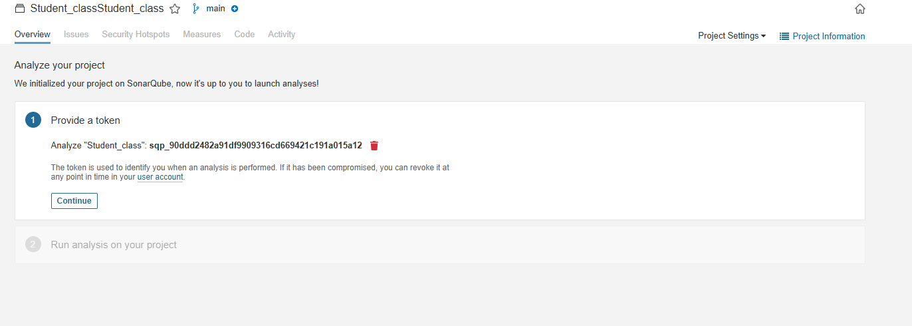
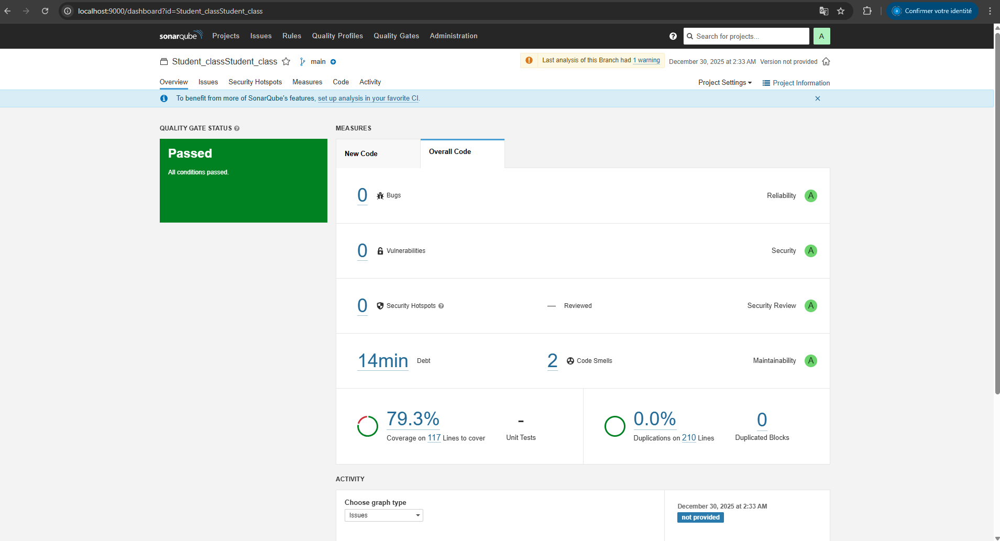
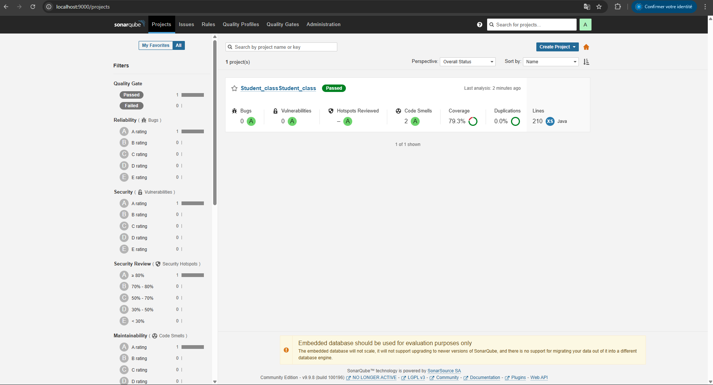

# TP28 - Analyse de Code avec SonarQube

## 🎯 Objectif de l'activité

Mettre en place **SonarQube** en local (Docker), créer un projet, générer un token, lancer l'analyse d'un projet Java Maven, puis interpréter les résultats (Quality Gate, bugs, odeurs de code, vulnérabilités, couverture…).




---

## 📋 Prérequis

- ✅ **Docker Desktop** (ou Docker Engine)
- ✅ **Navigateur Web**
- ✅ **JDK** installé (selon ton projet)
- ✅ **Maven** (ou Maven Wrapper `mvnw`)
- ✅ Un **projet Java Maven** (présence de `pom.xml`)

---

## 📁 Structure du TP

```
TP28/
├── README.md                    # Ce fichier (documentation complète)
├── sample-java-project/         # Projet Java Maven exemple
│   ├── pom.xml
│   └── src/
│       ├── main/java/com/example/
│       │   ├── Student.java
│       │   └── StudentService.java
│       └── test/java/com/example/
│           └── StudentTest.java
└── scripts/
    └── docker-commands.md       # Commandes Docker utiles
```

---

## 🚀 Étape 1 — Démarrer SonarQube en local (Docker)

### 1.1 Créer les volumes Docker (persistance)

Ces volumes gardent les données SonarQube entre les redémarrages (plugins, logs, index…).

**Commandes (Windows / Linux / Mac) :**

```bash
docker volume create sonarqube_data
docker volume create sonarqube_logs
docker volume create sonarqube_extensions
```

> 💡 **Remarque (débutant)** : Sans volumes, tout est perdu quand le conteneur est supprimé (projets, règles, historiques…).

### 1.2 Lancer SonarQube

**Exemple recommandé (édition Community LTS) :**

```bash
docker run -d --name sonarqube -p 9000:9000 ^
  -v sonarqube_data:/opt/sonarqube/data ^
  -v sonarqube_logs:/opt/sonarqube/logs ^
  -v sonarqube_extensions:/opt/sonarqube/extensions ^
  sonarqube:lts-community
```

> ⚠️ **Remarques :**
> - Si le port `9000` est occupé : utiliser `-p 9001:9000`, puis ouvrir `http://localhost:9001`
> - Sur Linux, SonarQube peut exiger un paramètre système pour Elasticsearch (`vm.max_map_count`)

### 1.3 Vérifier l'accès web

1. Ouvrir : **http://localhost:9000**
2. Identifiants par défaut : `admin` / `admin`
3. SonarQube demande ensuite de **changer le mot de passe**

---

## 📊 Étape 2 — Comprendre l'écran "Overview" et le Quality Gate

Après connexion, SonarQube affiche un tableau de bord où le **Quality Gate** indique si le projet respecte les critères minimaux.

### Critères du Quality Gate :
| Critère | Description |
|---------|-------------|
| **Bugs** | Erreurs potentielles dans le code |
| **Vulnerabilities** | Failles de sécurité |
| **Code Smells** | Problèmes de maintenabilité |
| **Coverage** | Couverture de tests |
| **Duplications** | Code dupliqué |

### 2.1 Exemple "Quality Gate Failed"

Un Quality Gate peut échouer si :
- Trop de bugs
- Couverture trop faible
- Trop de vulnérabilités

### 2.2 Exemple "Quality Gate Passed"

Quand toutes les conditions sont satisfaites, le projet est **"Passed"** ✅

> 💡 **Remarque (débutant)** : Le but n'est pas "zéro problème" immédiatement, mais de :
> 1. Corriger les **Bugs** et **Vulnérabilités** en priorité
> 2. Réduire progressivement les **Code Smells** (maintenabilité)
> 3. Améliorer la **couverture tests**

---

## 🛠️ Étape 3 — Créer un projet SonarQube (mode manuel / local)

### 3.1 Ouvrir "Projects"

Aller dans la barre du haut → **Projects**

### 3.2 Cliquer sur "Create Project"

En haut à droite, cliquer sur le bouton **Create Project**

### 3.3 Choisir "Manually" (projet local)

Si le code est sur la machine (pas sur GitHub/GitLab intégré à SonarQube), choisir **Manually**

### 3.4 Renseigner les informations du projet

| Champ | Exemple | Description |
|-------|---------|-------------|
| **Project display name** | `Student_class` | Nom lisible du projet |
| **Project key** | `Student_class` | Identifiant unique (utilisé par Maven) |

> ⚠️ **Important** : La `project key` est utilisée par la commande Maven (`-Dsonar.projectKey=...`). Éviter les espaces; utiliser `_` ou `-`.

---

## 📍 Étape 4 — Choisir "Analyser localement"

Après création, SonarQube demande comment analyser le dépôt :
- **CI** (Jenkins/GitHub Actions/GitLab…)
- ou **Localement** (pour ce TP)

👉 **Choisir : Locally**

---

## 🔑 Étape 5 — Générer un token (obligatoire)

Le token sert d'authentification pour autoriser l'analyse.

### 5.1 Générer un "project token"

1. **Token name** : ex. `Analyze "Student_class"`
2. **Expiration** : ex. `30 days`
3. Cliquer **Generate**

### 5.2 Récupérer le token généré

⚠️ **Copier et garder le token en lieu sûr !**

> 🔒 **Remarque importante (sécurité)** :
> - Le token est un **secret** : ne pas le publier, ne pas le commiter
> - Si un token apparaît dans des captures partagées, il faut le **révoquer** et en régénérer un

---

## ⚙️ Étape 6 — Choisir le scanner Maven et exécuter l'analyse

### 6.1 SonarQube propose la commande selon le build

Choisir **Maven** (si le projet est Maven).

### 6.2 Copier la commande Maven SonarScanner

**Windows (PowerShell) :**

```powershell
mvn clean verify sonar:sonar `
  -Dsonar.projectKey=Student_class `
  -Dsonar.host.url=http://localhost:9000 `
  -Dsonar.login=VOTRE_TOKEN
```

**Windows (cmd) :**

```cmd
mvn clean verify sonar:sonar ^
  -Dsonar.projectKey=Student_class ^
  -Dsonar.host.url=http://localhost:9000 ^
  -Dsonar.login=VOTRE_TOKEN
```

**Linux/Mac (bash/zsh) :**

```bash
mvn clean verify sonar:sonar \
  -Dsonar.projectKey=Student_class \
  -Dsonar.host.url=http://localhost:9000 \
  -Dsonar.login=VOTRE_TOKEN
```

> 💡 **Remarque (débutant)** :
> - `clean verify` : compile + lance les tests (si présents)
> - `sonar:sonar` : envoie le rapport à SonarQube
> - Si SonarQube tourne sur un autre port (ex `9001`), modifier `sonar.host.url`

### 6.3 Se placer dans le dossier du projet Maven

Le dossier doit contenir `pom.xml`.

```bash
cd sample-java-project
```

### 6.4 Lancer la commande d'analyse

Ouvrir un terminal dans ce dossier puis exécuter la commande.

**Résultat attendu :**
- ✅ Maven télécharge des dépendances (si nécessaire)
- ✅ Lance les tests
- ✅ Envoie l'analyse vers SonarQube
- ✅ Message final proche de : `"ANALYSIS SUCCESSFUL"`

---

## 📈 Étape 7 — Consulter les résultats dans SonarQube

### 7.1 Ouvrir le projet

Dans SonarQube : **Projects** → sélectionner `Student_class`

### 7.2 Lire les sections principales

| Section | Description |
|---------|-------------|
| **Overview** | Résumé + Quality Gate |
| **Issues** | Liste détaillée (Bugs, Code Smells…) |
| **Security Hotspots** | Points à valider (revue sécurité) |
| **Measures** | Métriques (duplication, complexité…) |
| **Code** | Code annoté + explications règle par règle |
| **Activity** | Historique des analyses |

### Ordre conseillé pour corriger :

1. 🔴 **Bugs** (priorité haute)
2. 🟠 **Vulnerabilities / Hotspots** (sécurité)
3. 🟡 **Code Smells** (petit à petit)
4. 🟢 **Coverage** (ajout de tests)

---

## 🔧 Dépannage (problèmes fréquents)

| Erreur | Cause | Solution |
|--------|-------|----------|
| **401 / Unauthorized** | Token invalide | Régénérer le token et relancer |
| **Connection refused** | SonarQube non démarré / mauvaise URL | Vérifier que le conteneur tourne |
| **Projet introuvable** | `sonar.projectKey` différent | Vérifier la clé du projet créé |
| **Analyse très lente** | Machine chargée / SonarQube pas "Ready" | Attendre ou redémarrer |

---

## 📝 Mini-récap (à écrire dans le compte rendu)

- [x] SonarQube tourne en local via Docker sur `localhost:9000`
- [x] Projet créé en mode **Manually**
- [x] Token généré et utilisé dans Maven
- [x] Analyse déclenchée via `mvn clean verify sonar:sonar`
- [x] Lecture du **Quality Gate** et des **issues** (priorité : bugs + sécurité)

---

## 📚 Commandes utiles

### Docker

```bash
# Voir les conteneurs en cours
docker ps

# Arrêter SonarQube
docker stop sonarqube

# Redémarrer SonarQube
docker start sonarqube

# Voir les logs
docker logs sonarqube

# Supprimer le conteneur (les volumes restent)
docker rm sonarqube
```

### Maven

```bash
# Compiler uniquement
mvn clean compile

# Exécuter les tests
mvn test

# Analyse complète avec SonarQube
mvn clean verify sonar:sonar -Dsonar.projectKey=... -Dsonar.host.url=... -Dsonar.login=...
```

---

